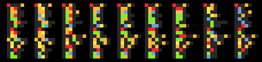
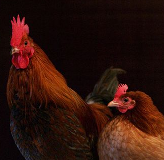

# asciipixels

Tiny Java parser, creating PNG graphics with a simple text file syntax.

## Intro

This script reads the content of a text file piped from the command line (see below).
The content of the text file should be a few header lines and a few body lines, in between there needs to be a fully blank line (not even spaces on it).

In the header symbols can be mapped to a color.
Later in the body pixels of an image are defined by symbols.
If a symbol was previously mapped to a color, this color will be used to color the pixel in the resulting output image.

This is an easy and fast way to create various graphics using a simple text file syntax.
The following examples show the creation of icons, simple linguistic comparisons and pixel art images.
Another idea would be simple statistics (like commit history, heat maps or habit tracking).

### Header Lines 

Within the header lines **variables** or **symbol-color pairs** can be defined, but these definitions are optionally.
If a variables isn't defined by the header then the parser will default to some internal value.
Also one is free to create any mappings between symbols and colors.

Also, header lines should not contain any spaces or unnecessary characters since this will result in parsing errors.

#### Variables

Four variables can be set:

 - `WIDTH` and `HEIGHT`,
 - `FILENAME` and
 - `DEFAULT`.
 
Defining the following:

 - the width and height of individual pixels (this can be used to scale images),
 - the filename under which to save the resulting image (type will be always PNG; ending will be added),
 - a default background color (either set to `WHITE` or `BLACK`); if none of the two is specified a transparent background will be chosen.

Values should be surrounded by quotes (`"`), and a equal sign (`=`) should split the left side (variable) from the right side (value).

Within the body, white space will be ignored, including: blank lines (except the one splititng the header and body), tabs and white spaces.

#### Symbol-Color Pairs

Lines that define symbol-color pairs should follow this layout: `w="255,255,255"`.
Namely: a single *character*, followed by three comma-separated *numbers* (ranging from 0-255), surrounded by quotes (`"`).

#### Body Lines

Body lines are all lines following the first completely blank line of text.
Body lines should describe the structural image data (the individual pixels) using (ASCII) characters.
While any color data of a pixel is encoded in the symbol-color pairs (referencing the character associated with a color).

Here are some header lines

```text
WIDTH="20"
HEIGHT="20"
FILENAME="test"
```
And symbol-color pairs could be these

```text
A="255,0,0"
w="255,255,255"
```

Adding some simple body lines, describing a simple *pixel pattern* could look like this
```text

wA
Cw
```

Then (if no further information is provided) the output should have colored `w` white, and `A` red, while `C` was assigned the background color (eg. transparent).

### Examples

Here is a complete parsable text file (containing header lines and body lines), resulting in the first image seen below.

```text
WIDTH="10"
HEIGHT="10"
FILENAME="colors"
DEFAULT="BLACK"
w="255,255,255"
D="0,0,0"
r="240,40,40"
R="200,0,0"
g="150,255,50"
G="70,150,0"
b="20,220,220"
B="50,30,150"
p="255,0,200"
P="150,10,110"
o="255,150,50"
O="255,150,50"
y="240,220,0"
Y="240,200,20"

XXXXXbXXXXX
XXXXGBOXXXX
XXXrgybOXXX
XXrYgbgboXX
XYrbbDpBgrX
GOGPDwDPBRR
XgrgPDgRgpX
XXrRgrprgXX
XXXybbrPXXX
XXXXOBBXXXX
XXXXXgXXXXX
```

#### Colors and Shapes


Other images can be created similarly.
The corresponding text files are contained within the project directory.

#### Icons

 <br/>
 

#### Comparison of Different Germanic languages

The image is comparing sound shifts.
It is an extract of a [vocabulary comparison](https://en.wikipedia.org/wiki/Germanic_languages#Vocabulary_comparison "Wikpedia: Germanic Languages") found on wikipedia, comparing words of English, Scots, West Frisian, Afrikaans, Dutch, Limburgish, Low German, Central German, German.

Colors of vowels are **a** - *red*, **e** - *orange*, **i** - *yellow*, **o** - *green*, **u** - *blue*, **ä** - *purple*, **ö** - *brown*, **ü** - *pink*.



#### A Smiley


#### Small Pixel Art


### Instructions 

Compile with `javac AsciiPixels.java`.

Execute with `java AsciiPixels < example.txt`.

Example output can be found in the sub folder `examples_txt2img/`.

### Notes 

 - default background colors can be set to "WHITE" or "BLACK" .
 - any other  value or not specifying a default will result in transparent background .
 - first blank line separates header form body .
 - blank lines in body will be ignored .
 - for symbols that are mapped to colors twice later mappings are ignored .

## Convert an Image to Ascii Text

There is a second class that can convert images to text, using `asciitext` image representation style.
This can be used to fastly create blueprints, for example when deriving a logo from existing image.

### Example

The program takes an existing image as input, here `chickens.png`:



The generated output will be saved under the file name `chickens_converted.png` (text abbreviated):

```text
HEIGHT="8"
FILENAME="chickens_converted"
A="13,5,3"
 ... 
q="140,78,49"

AAAAAAAAAAAAABBBB
BBBAAAAABBBBBBBBB
BCDBAAAABBBBBBBBB
BEFGAAAAAABBBBBBB
BHIJAAAAAAAABBBBB
BKLLMAAAAAABBBBBB
BJNOPMAAAAABBBBBB
BJLQRPBABABBBBBBB
BMMJPRPBAAABSTBBB
BMMJURVWAAASTTSBB
BXXXMPVYZBBTTKaXX
BXSXXMWbYZcSSdCWW
BBBBBBeXWZJWfgKhM
ABBBBBeXZeeJXeMeM
AiBBBBeeXeBMWjkhM
BiBBBBeeXXeXlmnok
BiieXeeeeXeTgpqno
```

The resulting text file can then be converted into a *pixel graphic*, as seen before.


### Instructions

With the class *Img2AsciiPixels* it is also possible to convert an existing image to Ascii text.

`java Img2AsciiPixels`

**Notes**: for now this class does not take any command line arguments, the parameters (eg filename) need to be changed in code.
Only letters of the latin alphabet are used so far, which means that images can only be reduced up to 52 colors.
If this is not enough the *threshold* should be raised, such that less new colors are created (and less colors will be used to represent the image's pixels).

Example output can be found in the sub folder `examples_img2txt/`.

## tasks

   - `AsciiPixels.java`.
     - next
       - [ ] do proper exception handling.
       - [ ] allow regexes on the left side of symbol-color pairs to map for several characters at once.
       - [ ] allow other characters (cyrillic, hiragana, etc).
       - [ ] allow comments (eg split at `//`, and omit everything afterwards).
     - other
       - [ ] take images as input (also command-line, distinguish by ending), output text file.
   -  `Img2AsciiPixels.java`.
     - [ ] get input from command line.
     - [ ] more symbols (A-Z, a-z ... then Cyrillic?).

## Meta 

Additional Sources:
- https://docs.oracle.com/javase/7/docs/api/java/awt/image/BufferedImage.html#getRGB(int,%20int)
- https://en.wikipedia.org/wiki/Ascii
- https://upload.wikimedia.org/wikipedia/commons/5/50/Female_pair.jpg

Useful Forum Threads:
- https://stackoverflow.com/questions/4731055/whitespace-matching-regex-java
- https://stackoverflow.com/questions/9909333/whats-the-default-value-of-char
- https://stackoverflow.com/questions/25761438/understanding-bufferedimage-getrgb-output-values
